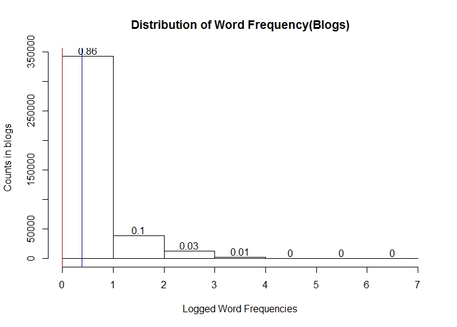
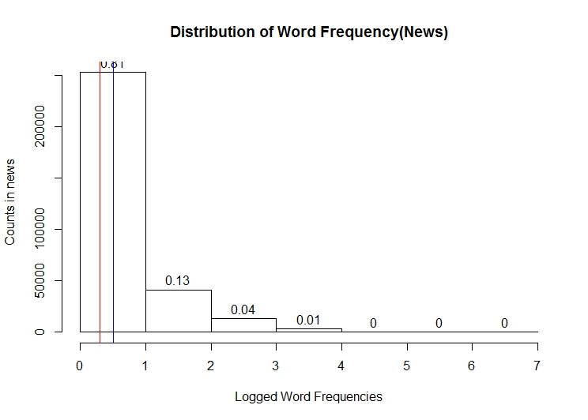
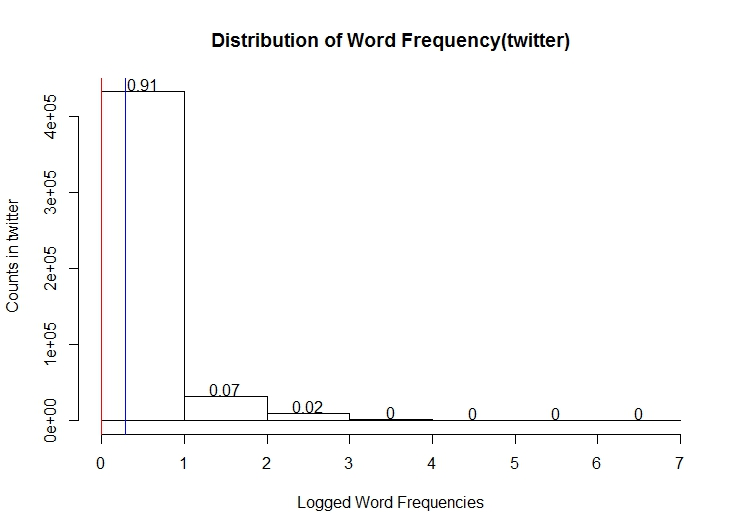

# Capstone Project: Milestone report
Sau-Chin Chen  
2015/7/25  
# Overview
This report summarizes our work on *SwiftyKey Data* this month. We demonstrate a rough app to show the function of language models.  

# Access and Load Raw Data
The data set was downloaded from [this link](https://d396qusza40orc.cloudfront.net/dsscapstone/dataset/Coursera-SwiftKey.zip). In consideration of the principles of cleaned data, the data set was downloaded by the below codes:  
```
if(!file.exists("data")) {
    dir.create("data")
}

fileUrl <- "https://d396qusza40orc.cloudfront.net/dsscapstone/dataset/Coursera-SwiftKey.zip"
download.file(fileUrl, destfile = "./data/Swiftkey.zip")
```
To preview the content of this zip file, we decompsed it to **final** folder and display the files compressed in the zip file:

```
##  [1] "de_DE/de_DE.blogs.txt"   "de_DE/de_DE.news.txt"   
##  [3] "de_DE/de_DE.twitter.txt" "en_US/en_US.blogs.txt"  
##  [5] "en_US/en_US.news.txt"    "en_US/en_US.twitter.txt"
##  [7] "fi_FI/fi_FI.blogs.txt"   "fi_FI/fi_FI.news.txt"   
##  [9] "fi_FI/fi_FI.twitter.txt" "ru_RU/ru_RU.blogs.txt"  
## [11] "ru_RU/ru_RU.news.txt"    "ru_RU/ru_RU.twitter.txt"
```
There are the documents collected from blogs, news, and twitters in four langauges/countries. This project concentrates on the documents collected from USA(English). To save the computation time and make sure the words encoded in the same protocol, we loaded the raw documents from the zip file as following:  
  
```
con1 <- unz("./data/Swiftkey.zip","final/en_US/en_US.blogs.txt")
con2 <- unz("./data/Swiftkey.zip","final/en_US/en_US.news.txt")
con3 <- unz("./data/Swiftkey.zip","final/en_US/en_US.twitter.txt")

blogs.docs <- readLines(con1, encoding = "UTF-8")
news.docs <- readLines(con2, encoding = "UTF-8")
twitter.docs <- readLines(con3, encoding = "UTF-8")
```

# Clean and Explore the US Documents
Because these data will be implimented for the functions of *SwiftyKey*, the punctuations and the white spaces were cleaned but the upper-letters and stopwords were reserved. This work was completed by the functions `removePunctuation()` and `stripWhitespace()` in the package `tm`.

Raw data had 210,160,014 blog documents, 1,010,243 news documents, and 167,105,338 twitter documents. Before we decided the sampling strategy to get the documents to build the language models, we compared the word frequency distributions among the three document sources.  


# Distribustions of Word Frequencies  
The word frequencies are summarized from the tokens in the US blogs, news, and twitters respectively. The tokens are calculated from the cleaned documents with the following codes:   
```
blogs.words <- textcnt(blogs.docs, method = "string", n = 1L, decreasing = TRUE)  
news.words <- textcnt(news.docs, method = "string", n = 1L, decreasing = TRUE)  
twitter.words <- textcnt(twitter.docs, method = "string", n = 1L, decreasing = TRUE)
```

This data set collected 397,288 words from blogs, 310,824 words from news, and 476,133 words from twitter. Because the maximal words frequencies in the three sources are larger than 1 million, all the frequency values are logged and illustrated in three histograms. It is the significant finding that all three distributions are similar in the skewness. (Red line and blue line refers to median and mean.)


```r
blogs.dist <- hist( log10(blogs.words), breaks = 0:(round(max(log10(blogs.words) ), digit=0 ) +1 ), xlab = "Logged Word Frequencies", ylab="Counts in blogs", main = "Distribution of Word Frequency(Blogs)")
text(blogs.dist$mids, blogs.dist$counts + 10000, round(blogs.dist$density, digits = 2) )
abline( v =summary(log10(blogs.words))[3:4], col = c("red","blue"))
```


```r
news.dist <- hist( log10(news.words), breaks = 0:(round(max(log10(news.words) ), digit=0 ) +1 ), xlab = "Logged Word Frequencies", ylab="Counts in news", main = "Distribution of Word Frequency(News)")
text(news.dist$mids, news.dist$counts + 10000, round(news.dist$density, digits = 2) )
abline( v =summary(log10(news.words))[3:4], col = c("red","blue"))
```


```r
twitter.dist <- hist( log10(twitter.words), breaks = 0:(round(max(log10(twitter.words) ), digit=0 ) + 1), xlab = "Logged Word Frequencies", ylab="Counts in twitter", main = "Distribution of Word Frequency(twitter)")
text(twitter.dist$mids, twitter.dist$counts + 10000, round(twitter.dist$density, digits = 2) )
abline( v =summary(log10(twitter.words))[3:4], col = c("red","blue"))
```


This finding support our action that samples each 10% documents from three sources as the corpus. A series of random numbers is decided for the access of 426,966 documents as our corpus to build the language models:  
```
{  
set.seed(12345)  
blogs.seq <- sample(1:length(blogs.docs), length(blogs.docs)*.1)  
news.seq <-  sample(1:length(news.docs), length(news.docs)*.1)  
twitter.seq <-  sample(1:length(twitter.docs), length(twitter.docs)*.1)  
}
```

# Making of Language Models

Because of the limitation of system memory, this report and our shiny app demonstrates the uni-gram model and bi-grams model. We retrieved the sampled documents from the raw data becuase many documents have many sentences. This means we need `Maxent_Sent_Token_Annotator()` in the package `openNLP`. The sentences are splited in use of below codes:
```
Training.sen <- NULL
for(i in 1:length(Training.doc)){
    if(nchar(as.String(Training.doc[i])) <= 1 ){
        Training.sen <- c(Training.sen, "0")
    }
    else{
        doc <- as.String(Training.doc[i])
        t <- annotate(doc, sent_token_annotator)
        Training.sen <- c(Training.sen, doc[t])
    }
}

```

In the summary of [Coursera course on NLP](https://class.coursera.org/nlp), [Graham Neubig's slides 1](http://www.phontron.com/slides/nlp-programming-en-01-unigramlm.pdf)and [slides 2](http://www.phontron.com/slides/nlp-programming-en-02-bigramlm.pdf), we build the rough uni-gram model and bi-grams model as following. The uni-gram from the sample documents are retrieved as the following codes:
```
Training.uni <- textcnt(Training.sen, tolower = FALSE, method = "string", n = 1, decreasing = TRUE)
```

Uni-gram model predicts the likelihood of a readible sentence by times the estimation of each word. The estimations could be smoothed by define a constant probability. We defines this constant probability .95, and the likelihood of an unknown word(out of our corpus) is estimated by this parameter. We build the vector `Training.unimodel.smooth` stored the estimations of our uni-grams. Each estimation is a negative value trasfered from log(p):
```
# Estimate original uni-gram 
Training.unimodel <- Training.uni/length(Training.sen)

# Smoothing unimodel
LAMBA.uni <- .95
Training.unimodel.smooth <- log( LAMBA.uni*Training.unimodel + (1 - LAMBA.uni)*(1/length(Training.unimodel)) )

```

Marking bi-grams has to define the boundries of a sentence. We append the tags *si* and *se* to each sentence before we retrieved the bi-grams:
```
Training.sen1 <- paste0(paste("si", Training.sen, " "), "se")

Training.bi <- textcnt(Training.sen1, tolower = FALSE, method = "string", n = 2, decreasing = TRUE)

## Remove "se si"
Training.bi <- Training.bi[-1]
```

Bi-gram model predicts the likelihood of a readible sentence by times the estimation of each bi-gram included the sentence initial(*si*) and the sentence end(*se*). The estimation of each bi-gram was smoothed in terms of Witten-Bell approach ( *see [Graham Neubig's slides 2](http://www.phontron.com/slides/nlp-programming-en-02-bigramlm.pdf)* ). The maximal value generated by Witten-Bell approch is defined as the constant probability for unknown words. We build the data frame `Training.bi.df` stored the estimations of our bi-grams. Each estimation is a negative value trasfered from log(p):
```
## Build raw data frame stored the original estimations
Training.bi.df <- data.frame( cbind(matrix( unlist( strsplit( names(Training.bi), " " ) ),nc=2, byrow=T), Training.bi) )
colnames(Training.bi.df) <- c("prior1", "word", "c1")
Training.bi.df$prior1 <- as.factor(Training.bi.df$prior1)
Training.bi.df$word <- as.factor(Training.bi.df$word)
Training.bi.df$c1 <- as.numeric(Training.bi.df$c1)
rm(Training.bi)
Training.bi.df <- data.frame( 
    cbind(
        cbind( 
            Training.bi.df,
            p_prior = Training.unimodel[as.character(Training.bi.df$prior1)]
        ),
        p_bigrams = Training.bi.df$c1/Training.uni[as.character(Training.bi.df$prior1)]
    )
)
## Calcuate the type frequency for smoothing process
type1 <- table(Training.bi.df$prior1)

## Smoothing Bi-gram model
LAMBA.bi <- 1 - Training.uni[names(type1)]/(Training.uni[names(type1)]+type1)
rm(type1)

## Appened smoothed esimtations to the data frame
Training.bi.df <- data.frame( 
    cbind(
        Training.bi.df,
        p_smooth_bigrams = LAMBA.bi[as.character(Training.bi.df$prior1)]*Training.bi.df$p_bigrams + (1 - LAMBA.bi[as.character(Training.bi.df$prior1)])*Training.unimodel[as.character(Training.bi.df$word)]
    )
)
```

The shiny app demonstrate how to predict the readibility of a sentence in use of our models. You will access our app on our submission page.
